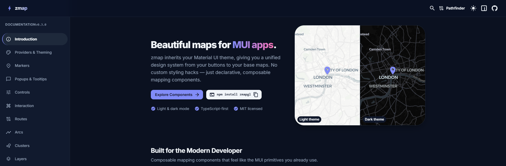

<div align="center">

# 🗺️ zmap

**MUI-native, theme-aware map components for React — built on [MapLibre GL](https://maplibre.org/).**

One install, one stylesheet import. Markers, popups, tooltips, controls, routes, arcs,
clustering and toggleable data layers — composable components that render through
MUI and follow your theme, including automatic light/dark basemaps.

[**Docs & live demos**](https://yoavzada.github.io/zmap) · [Quick start](#quick-start) · [Components](#components) · [Providers & theming](#providers--theming)

[](https://www.npmjs.com/package/zmapgl)
[](LICENSE)
[](https://maplibre.org/)
[](https://mui.com/)
[](https://www.typescriptlang.org/)



</div>

---

There's no shortage of map libraries for React — but if your app is built on
**MUI**, none of them feel native. zmap is the missing piece: drop a `<Map>` into
your MUI app and the controls, popups and markers are MUI components, the basemap
tracks your theme's light/dark mode, and palette tokens like `"primary.main"` just
work. It stays close to MapLibre GL, so you can always reach the raw map instance.

## Features

- 🎨 **Theme-aware** — the basemap swaps light ↔ dark with your MUI theme; every control and overlay is a real MUI component.
- 🎯 **Zero config** — sensible defaults and free CARTO tiles; no API key to get started.
- 🧩 **Composable** — declarative React components you nest inside `<Map>`, the way you'd expect.
- 🗺️ **MapLibre GL powered** — hardware-accelerated vector maps, no vendor lock-in; drop down to the raw instance via `useMap()`.
- 📍 **Markers, popups & tooltips** — render _any_ MUI element (icons, chips, avatars, cards) at a coordinate via portals.
- 🎮 **Controls** — MUI zoom, compass, geolocate, fullscreen and a scale bar.
- 🛤️ **Routes & arcs** — draw polylines and curved (bezier or great-circle) connection lines.
- 🟣 **Clustering** — native MapLibre clustering rendered as themed MUI bubbles, click-to-expand.
- 🗂️ **Layers** — group overlays into a themed `LayerControl` panel to toggle visibility; bulk-render data with `PointLayer`, `HeatmapLayer` and choropleth `ShapeLayer`.
- 🔌 **Pluggable providers** — CARTO and OpenStreetMap built in; drop in any MapLibre style URL/spec (MapTiler, Stadia, self-hosted).
- 🟦 **Fully typed** — written in TypeScript, ships its own types.

## Installation

```bash
npm install zmapgl @mui/material @mui/icons-material \
  @emotion/react @emotion/styled maplibre-gl
```

`react`, `react-dom`, MUI and Emotion are peer dependencies. Add the map
stylesheet once, in your app entry:

```ts
import "zmapgl/styles.css";
```

## Quick start

Wrap your app in an MUI `ThemeProvider` (as you already do), then compose a map:

Components are declared as a typed `FC` arrow, default-exported (the repo
convention):

```tsx
import "zmapgl/styles.css"; // once, in your app entry
import type { FC } from "react";
import { Map, MapControls, Marker, Popup } from "zmapgl";

const MyMap: FC = () => {
  return (
    <Map center={[-0.1276, 51.5072]} zoom={11} sx={{ height: 420 }}>
      <MapControls position="top-right" />
      <Marker longitude={-0.1276} latitude={51.5072} />
      <Popup longitude={-0.1276} latitude={51.5072}>
        Hello, London 👋
      </Popup>
    </Map>
  );
};

export default MyMap;
```

## Start from a template

```bash
npx degit YoavZada/zmap/templates/vite my-map-app
cd my-map-app && npm install && npm run dev
```

Or open any [Block](https://yoavzada.github.io/zmap/blocks) directly in
StackBlitz — every block is a complete, runnable app.

## Components

| Component         | What it does                                                       |
| ----------------- | ------------------------------------------------------------------ |
| `Map`             | Container; creates the MapLibre instance and provides context.     |
| `Marker`          | Renders any MUI content at a coordinate (portal-based).            |
| `Popup`           | Theme-aware popup anchored to a coordinate.                        |
| `Tooltip`         | Lightweight, non-interactive label (a Popup variant).              |
| `MapControls`     | MUI zoom / compass / geolocate / fullscreen / scale cluster.       |
| `Route`           | Draws a polyline from coordinates.                                 |
| `Arc`             | Draws a curved (bezier or great-circle) line between two points.   |
| `Cluster`         | Native MapLibre clustering rendered as themed MUI markers.         |
| `LayerControl`    | Collapsible MUI panel that toggles registered layers on/off.       |
| `Layer`           | Registers a named, toggleable overlay (pairs with `LayerControl`). |
| `PointLayer`      | Renders many points as a single GPU circle layer.                  |
| `HeatmapLayer`    | Renders points as a density heatmap.                               |
| `ShapeLayer`      | GeoJSON polygons / lines, with optional choropleth fill.           |
| `GeoJSONLayer`    | Low-level escape hatch for custom sources + layers.                |
| `SymbolLayer`     | GPU text labels/icons for many points.                             |
| `ChoroplethLayer` | Data-driven polygon coloring with ramps and hover states.          |
| `HexbinLayer`     | Aggregates points into hex/square bins, flat or extruded.          |
| `ExtrusionLayer`  | Extrudes polygons into 3D prisms (buildings, data heights).        |
| `TimePlayback`    | Animates time-stamped points with a themed transport bar.          |
| `DrawControl`     | Draw points, lines, and polygons with a themed toolbar.            |
| `MeasureControl`  | Measure distances and areas interactively.                         |
| `SelectControl`   | Box and lasso selection over map features.                         |
| `ContextMenu`     | Right-click menu with MUI menu items at the clicked location.      |
| `Legend`          | Themed legend panel for color ramps and categories.                |

Hooks: `useMap()` (the raw MapLibre instance), `useMapLayer()`, `useColorScheme()`,
`useFeatureState()`, `useDraw()`, `useLayerVisibility()`.

## Providers & theming

Switch basemaps with a single prop:

```tsx
<Map provider="carto" />   {/* default — positron / dark-matter, theme-aware */}
<Map provider="osm" />     {/* OpenStreetMap raster */}

{/* Anything MapLibre-compatible: */}
<Map provider="https://tiles.example.com/style.json" />
<Map provider={myStyleSpecification} />
```

`colorScheme` controls light/dark: `"auto"` (default, follows the MUI theme),
`"light"`, or `"dark"`. Add your own provider by implementing the `MapProvider`
interface — see [the package README](packages/zmap/README.md).

### Basemap terms of service

The default **CARTO** basemaps are derived from OpenStreetMap data and are free
for development:

- **Commercial use** requires a CARTO Enterprise license — see [CARTO's terms](https://carto.com/legal/).
- **Non-commercial / evaluation** use is free under CARTO's basemap terms.
- **Alternatives:** switch `provider` to OpenStreetMap, or any MapLibre-compatible
  source (MapTiler, Stadia Maps, self-hosted). You're responsible for complying
  with the chosen provider's usage policy and attribution.

## Development

This is a pnpm monorepo (the `zmap` package, a docs/showcase site, and a
Dijkstra pathfinding demo), orchestrated by Turborepo:

```bash
pnpm install
pnpm docs      # docs & component showcase
pnpm build     # build every package (library, docs, pathfinder demo)
pnpm test      # run the library test suite
```

## Contributing

Contributions are welcome!

1. Fork the repository
2. Create a feature branch (`git checkout -b feature/amazing-feature`)
3. Commit your changes (`git commit -m "Add amazing feature"`)
4. Add a changeset if the change is user-visible (`pnpm changeset`)
5. Push the branch (`git push origin feature/amazing-feature`)
6. Open a Pull Request

Please follow the repo's coding conventions (see the [docs site](https://yoavzada.github.io/zmap))
and keep `pnpm typecheck` and `pnpm lint` green.

## License

[MIT](LICENSE) © Yoav Zada.

## Acknowledgements

Inspired by [mapcn](https://github.com/AnmolSaini16/mapcn) (the shadcn/Tailwind
take on map components). Built on [MapLibre GL](https://maplibre.org/) and
[MUI](https://mui.com/).

<div align="center"><sub>Built by <a href="https://github.com/YoavZada">@YoavZada</a></sub></div>
